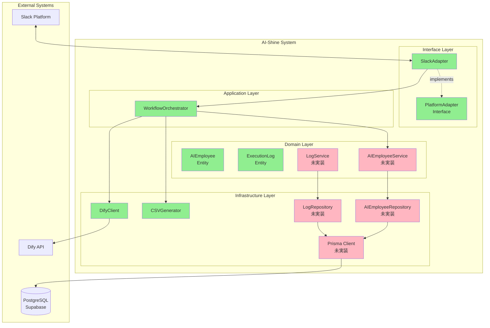
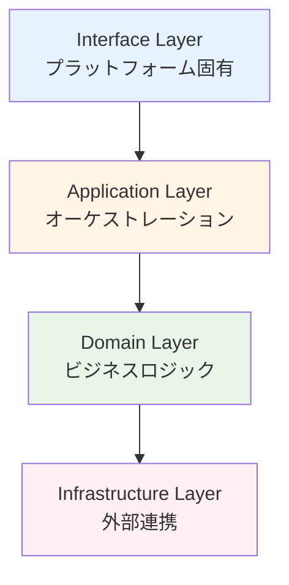
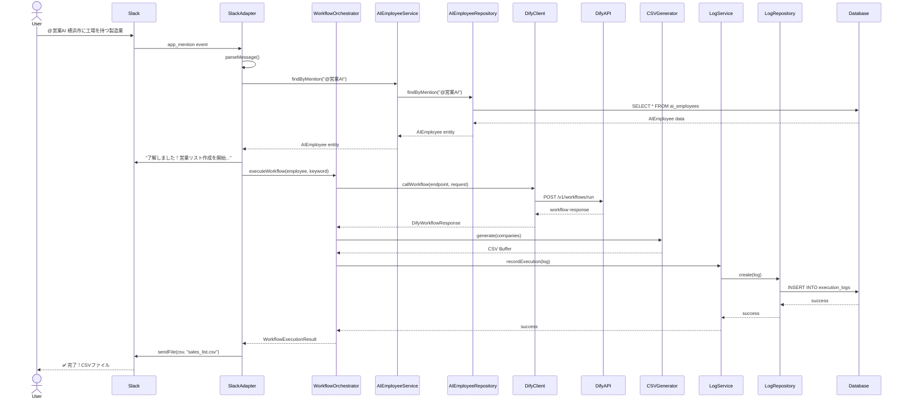
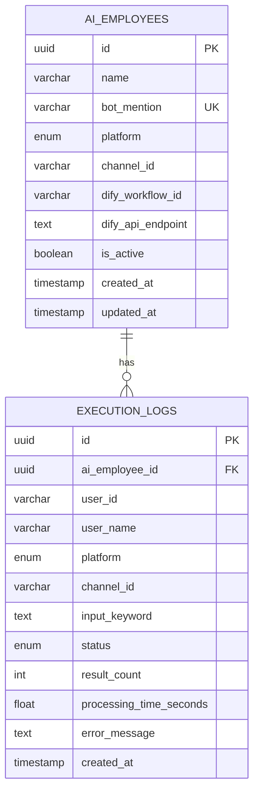
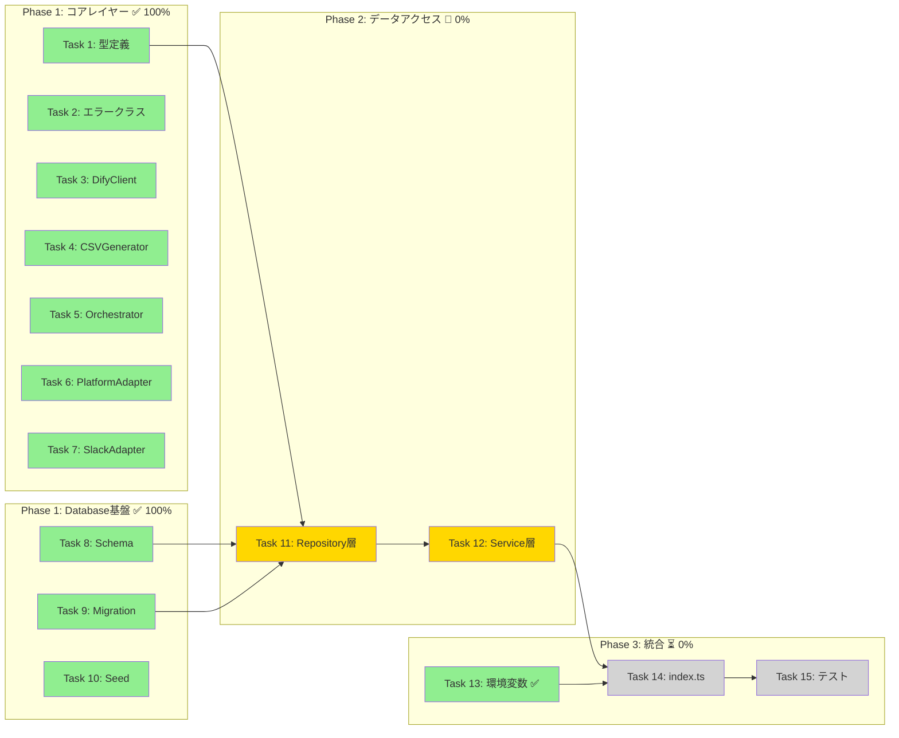
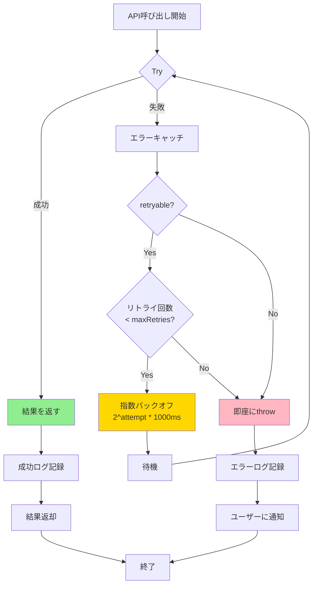

# AI-Shine システム図解

**最終更新**: 2026-01-21
**進捗**: Phase 1 - 67%完了

---

## 目次

1. [アーキテクチャ概要図](#1-アーキテクチャ概要図)
2. [レイヤー依存関係図](#2-レイヤー依存関係図)
3. [データフロー図（正常系）](#3-データフロー図正常系)
4. [クラス図（実装済みコンポーネント）](#4-クラス図実装済みコンポーネント)
5. [データベースER図](#5-データベースer図)
6. [進捗状況図](#6-進捗状況図)
7. [ディレクトリ構造図](#7-ディレクトリ構造図)
8. [エラーハンドリングフロー図](#8-エラーハンドリングフロー図)

---

## 1. アーキテクチャ概要図

**凡例**:
- 🟢 緑: 実装済み
- 🔴 ピンク: 未実装（Task 11-12）

---

## 2. レイヤー依存関係図

**ルール**:
- ❌ 上位レイヤーへの依存禁止
- ❌ レイヤーのスキップ禁止
- ✅ 下位レイヤーのみ依存可能

---

## 3. データフロー図（正常系）

---

## 4. クラス図（実装済みコンポーネント）

```mermaid
classDiagram
    %% Interface Layer
    class PlatformAdapter {
        <<interface>>
        +sendMessage(channelId, text) Promise~void~
        +sendFile(channelId, file, filename, comment) Promise~void~
        +sendErrorWithRetry(channelId, errorMessage, threadTs) Promise~void~
        +onMention(handler) void
    }

    class SlackAdapter {
        -app: App
        +constructor(botToken, signingSecret)
        +start(port) Promise~void~
        +sendMessage(channelId, text) Promise~void~
        +sendFile(channelId, file, filename, comment) Promise~void~
        +sendErrorWithRetry(channelId, errorMessage, threadTs) Promise~void~
        +onMention(handler) void
        -extractMention(text) string
    }

    %% Application Layer
    class WorkflowOrchestrator {
        -difyClient: DifyClient
        -csvGenerator: CSVGenerator
        +constructor(difyClient, csvGenerator)
        +executeWorkflow(endpoint, keyword) Promise~WorkflowExecutionResult~
        -retryWithBackoff(fn, maxRetries) Promise~T~
    }

    %% Domain Layer
    class AIEmployee {
        +id: string
        +name: string
        +botMention: string
        +platform: Platform
        +channelId: string
        +difyWorkflowId: string
        +difyApiEndpoint: string
        +isActive: boolean
        +createdAt: Date
        +updatedAt: Date
    }

    class ExecutionLog {
        +id: string
        +aiEmployeeId: string
        +userId: string
        +userName: string
        +platform: Platform
        +channelId: string
        +inputKeyword: string
        +status: ExecutionStatus
        +resultCount: number
        +processingTimeSeconds: number
        +errorMessage: string
        +createdAt: Date
    }

    %% Infrastructure Layer
    class DifyClient {
        -client: AxiosInstance
        -apiKey: string
        +constructor(apiKey)
        +callWorkflow(endpoint, request) Promise~DifyWorkflowResponse~
    }

    class CSVGenerator {
        +generate(data) Buffer
    }

    %% Utils
    class AIShineError {
        +code: string
        +retryable: boolean
        +constructor(message, code, retryable)
    }

    class NetworkError {
        +constructor(message)
    }

    class TimeoutError {
        +constructor(message)
    }

    class DifyAPIError {
        +statusCode: number
        +constructor(message, statusCode)
    }

    %% Relationships
    SlackAdapter ..|> PlatformAdapter
    WorkflowOrchestrator --> DifyClient
    WorkflowOrchestrator --> CSVGenerator
    NetworkError --|> AIShineError
    TimeoutError --|> AIShineError
    DifyAPIError --|> AIShineError
```

---

## 5. データベースER図

**Enums**:
- `Platform`: SLACK, LINE, TEAMS
- `ExecutionStatus`: SUCCESS, ERROR, TIMEOUT

---

## 6. 進捗状況図

**凡例**:
- 🟢 緑: 完了
- 🟡 黄: 進行中（別の人が担当）
- ⚪ 灰: 未着手

**進捗率**: 67% (10/15 タスク)

---

## 7. ディレクトリ構造図

```mermaid
graph TD
    Root[ai-shain/]

    Root --> Src[src/]
    Root --> Prisma[prisma/]
    Root --> Docs[docs/]
    Root --> Tasks[tasks/]

    Src --> Interfaces[interfaces/]
    Src --> Application[application/]
    Src --> Domain[domain/]
    Src --> Infrastructure[infrastructure/]
    Src --> Config[config/]
    Src --> Utils[utils/]

    Interfaces --> Slack[slack/]
    Interfaces --> PlatformAdapterTS["PlatformAdapter.ts ✅"]
    Slack --> SlackAdapterTS["SlackAdapter.ts ✅"]

    Application --> WorkflowOrchestratorTS["WorkflowOrchestrator.ts ✅"]

    Domain --> Entities[entities/]
    Domain --> Services[services/]
    Domain --> Types[types/]

    Entities --> AIEmployeeTS["AIEmployee.ts ✅"]
    Entities --> ExecutionLogTS["ExecutionLog.ts ✅"]

    Services --> AIEmployeeServiceTS["AIEmployeeService.ts ⏳"]
    Services --> LogServiceTS["LogService.ts ⏳"]

    Types --> IndexTS["index.ts ✅"]

    Infrastructure --> Database[database/]
    Infrastructure --> Dify[dify/]
    Infrastructure --> CSV[csv/]

    Database --> Repositories[repositories/]
    Database --> PrismaTS["prisma.ts ⏳"]
    Repositories --> AIEmployeeRepositoryTS["AIEmployeeRepository.ts ⏳"]
    Repositories --> LogRepositoryTS["LogRepository.ts ⏳"]

    Dify --> DifyClientTS["DifyClient.ts ✅"]
    Dify --> DifyTypesTS["DifyTypes.ts ✅"]

    CSV --> CSVGeneratorTS["CSVGenerator.ts ✅"]

    Config --> EnvTS["env.ts ✅"]
    Utils --> ErrorsTS["errors.ts ✅"]

    Prisma --> SchemaPrisma["schema.prisma ✅"]
    Prisma --> Migrations["migrations/ ✅"]
    Prisma --> SeedTS["seed.ts ✅"]

    style PlatformAdapterTS fill:#90EE90
    style SlackAdapterTS fill:#90EE90
    style WorkflowOrchestratorTS fill:#90EE90
    style AIEmployeeTS fill:#90EE90
    style ExecutionLogTS fill:#90EE90
    style IndexTS fill:#90EE90
    style DifyClientTS fill:#90EE90
    style DifyTypesTS fill:#90EE90
    style CSVGeneratorTS fill:#90EE90
    style EnvTS fill:#90EE90
    style ErrorsTS fill:#90EE90
    style SchemaPrisma fill:#90EE90
    style Migrations fill:#90EE90
    style SeedTS fill:#90EE90
    style AIEmployeeServiceTS fill:#FFD700
    style LogServiceTS fill:#FFD700
    style PrismaTS fill:#FFD700
    style AIEmployeeRepositoryTS fill:#FFD700
    style LogRepositoryTS fill:#FFD700
```

---

## 8. エラーハンドリングフロー図

**エラー分類**:
- `NetworkError` (retryable: ✅)
- `TimeoutError` (retryable: ✅)
- `DifyAPIError` (500番台のみ retryable: ✅)
- `ValidationError` (retryable: ❌)

---

## 図の利用方法

### GitHub/GitLabで表示
このマークダウンファイルをGitHubにプッシュすると、Mermaid図が自動的にレンダリングされます。

### VS Codeで表示
拡張機能「Markdown Preview Mermaid Support」をインストールすると、プレビューで図が表示されます。

### draw.ioにインポート
1. [draw.io](https://app.diagrams.net/)を開く
2. "Arrange" > "Insert" > "Advanced" > "Mermaid"
3. Mermaidコードを貼り付け

### オンラインビューア
[Mermaid Live Editor](https://mermaid.live/)でリアルタイム編集・プレビュー可能

---

**作成日**: 2026-01-21
**バージョン**: 1.0
**作成者**: Claude Sonnet 4.5
